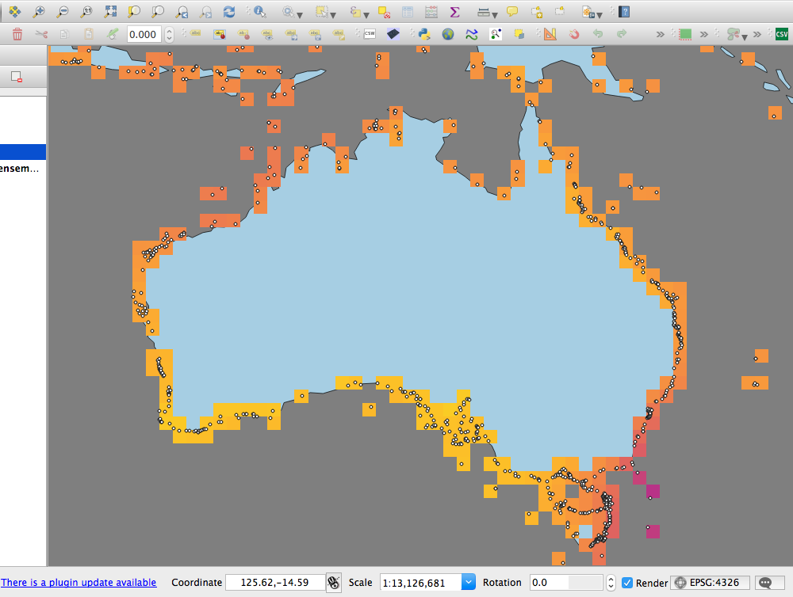

## Task summary


The project aims to look at projected climate warming in Marine Protected Areas. It uses climate models ([CMIP5](http://cmip-pcmdi.llnl.gov/cmip5/)) run for two emission scenarios (Representative Concentration Pathways - [RCPs](https://www.skepticalscience.com/rcp.php?t=1)) - 4.5degC and 8.5degC - developed as part of Intergovernmental Panel on Climate Change's (IPCC) Fifth Assessment Report ([AR5](http://www.ipcc-data.org/sim/gcm_monthly/AR5/)).

As part of the study, the temperature data need to be modified to exclude land-based temperature measures but retaining SSTs (Sea Surface Temperatures). This will enable:

> ...supporting analysis, comparing the projected mean warming for all MPAs or all MPAs in a region (eg, the tropics) with the ambient (ie, whole ocean or region) warming rate. To answer the question: is warming in MPAs comparable, less, more than the oceans as a whole?

John Bruno, 2017

This notebook will provide code that removes the land surface temperatures from the CMIP5 surface temperature rasters.

## Setup

```{r}
# Packages
library(dplyr) # Data wrangling and exploration
library(ggplot2) # Plotting
library(tidyr) # Data wrangling
library(raster) # Dealing with rasters
library(rasterVis) # Dealing with rasters
library(viridis) # Perceptually sound palettes
library(sp) # Classes and methods for spatial data
library(ncdf4) # Required - viewing and working with climate data in netCDF format
library(rgdal) # For working with shapefiles
```

## Approach


The approach I'll take is to select cells from the CMIP5 grid that fall *wholly* within the boundary of the world land surface polygon. This is because CMIP5 data is provided as a 360 \* 180 (1 \* 1 degree) grid. Raster-based analysis of temperatures - ie to quantify whole ocean or region warming - uses temperature data for each cell, so temperature values from single cells are what we're interested in. By only discarding cells that fall entirely within the land surface we ensure that SSTs for MPAs found within grid cells that overlap coastlines will be retained for analysis.


## MPAs

Marine Protected Areas
```{r}
mpas <- read.csv("../nn_extractedA2c.csv", header = TRUE)
# glimpse(mpas) # Peek at the data
```

## Inspect CMIP5 RCP8.5 data 

Read CMIP5 RCP8.5 mean
```{r}
name85 <- "../trend_yearmean_ensemble_tos_RCP85.nc"
mean85 <- raster(name85) # Read in raster
map.extent <- c(-180, 180, -90, 90) # Reset for layer, orginal orientation was 0-360 longitude
extent(mean85) <- map.extent # Change extent

source("../revrotate.R") # Rotate raster layer to align with MPA points
mean85 <- revrotate(mean85)
extent(mean85) <- map.extent

mean85@crs

rm("map.extent")
# writeRaster(x = mean85, filename = "../mean85.nc") # Output

```

Inspect structure and values using `ncdf4` package.

```{r}
nc <- nc_open(filename = name85) # Open connection to netCDF file
# print(nc) # View dataset structure
nc_close(nc) # Close connection
rm(nc)
```


Inspect *Longitude and Latitude* grid.
```{r}
nc <- nc_open(filename = name85)
lon <- ncvar_get(nc = nc, varid = "lon") # Longitude named "lon" in netCDF
lat <- ncvar_get(nc = nc, varid = "lat") # Latitude named "lat" in netCDF

dim(lon); dim(lat)
head(lon); head(lat)

nc_close(nc) # Close connection
rm("lon", "lat", "nc")
```
Data is on a 1 \* 1 degree grid.

Inspect *Time* variable.
```{r}
nc <- nc_open(filename = name85)
t <- ncvar_get(nc = nc, varid = "time") # Time named "time" in netCDF

tunits <- ncatt_get(nc = nc, varid = "time", attname = "units")
dim(t)
tunits

nc_close(nc) # Close connection
rm("t", "tunits", "nc")
```
Only one time slice in the dataset.


Inspect *Temperature* variable.
```{r}
nc <- nc_open(filename = name85) # Open connection to netCDF file
print(nc) # View dataset structure

dname <- "tos" # name of variable found from `print(nc)`
tmp.df <- as_data_frame(ncvar_get(nc = nc, varid = dname)) # Get temperature (tmp) data 
colnames(tmp.df) <- 1:180
# glimpse(tmp.df) # Peek at data

nc_close(nc)  # Close connection
rm(dname, nc, name85)
```
360 \* 180 dataset (1 \* 1 degree grid) of temperature trend values (? degree C / year).

## Obtain world land surface raster data

Read in [Natural Earth](http://www.naturalearthdata.com/) 1:110m world vector, then convert to simple raster.

```{r}
# Natural Earth 110m data. Comes as zip file 
url <- "http://www.naturalearthdata.com/http//www.naturalearthdata.com/download/110m/physical/ne_110m_land.zip" # web location

localDir <- "../data"

if (!file.exists(localDir)) {
  dir.create(localDir)
}

dwnld <- paste(localDir, basename(url), sep = "/") # zip file destination

if (!file.exists(dwnld)) {
  download.file(url = url, destfile = dwnld, method = "auto") # download from web
  unzip(dwnld, exdir = localDir) # unzip
}

list.files(localDir) # check unzip

rm(url, dwnld) # clean up workspace
```

## Mask CMIP5 raster with land surface

### Mask directly using land polygons 

```{r read-land-vector}

# localDir object from chunk `get-land-vector`. Alternatively, specify location of the land vector shapefile.

land <- readOGR(dsn = localDir) # Read in shapefile using `rgdal`. No need to specify shapefile name as there's only one in the directory we created above.

# View projection
land@proj4string
# Looks to match CMIP5 apart from "+no_defs". This item ensures no defaults are read in. So probably a good idea to implement this in the CMIP5 data.

rm(localDir)

```

Mask raster to remove cells covered by land. Updates cells within mask to NA. But from the `raster::rasterize` description the masking algorithm works in the following way:

> For polygons, values are transferred if the polygon covers the center of a raster cell.

```{r}
mean85.sst <- mask(x = mean85, mask = land, inverse = TRUE)
```
So this is not likely to be a complete solution - likely that near-shore MPAs will be missing temperature data.

### Check MPA cell values 

Query raster cells to check that MPA SST cells are not NA.

```{r}
mpa.cells <- raster::extract(x = mean85.sst, y = mpas[,2:3]) # Use `raster::extract()` to disambiguate from `tidyr::extract`

length(mpa.cells[is.na(mpa.cells)])
```
There's a problem here. 3590 of the 8456 MPAs fall in NA cells - no temperature data. Evidently some raster cells are being masked by `raster::mask` that we don't want to exclude. 

Let's plot a part of the raster around Australia to see what's going on.

```{r}
land.gg <- fortify(land) # Convert shapefile to data_frame useable by ggplot. `Fortify` may be deprecated in the future and the `broom` package should be used.

# Set coordinate limits around Australia
xlims <- c(110, 160)
ylims <- c(-50, -10)

p.test <- gplot(mean85.sst, maxpixels = 50000) + # Note: uses `gplot` here not `ggplot` - uses `rasterVis`. maxpixels = 50000 is default out of the box for gplot
  geom_raster(aes(fill = value)) +
  scale_fill_viridis(direction = -1, option = "plasma", breaks = seq(0.02, 0.16, 0.02)) +
  geom_polygon(data = land.gg, aes(x = long, y = lat, group = group), colour = "green", fill = NA) +
  geom_point(data = mpas, mapping = aes(x = Centroid_Longitude, y = Centroid_Latitude), size = 0.1, colour = "black") + 
  xlim(xlims) +
  ylim(ylims) +
  guides(fill = guide_colorbar(title = expression(paste(degree, C,"/year")), barheight = 16, raster = TRUE)) + 
  theme(legend.title = element_text(size = 9)) +
  ggtitle("RCP 8.5 warming rate for mean SST") + 
  xlab("Longitude") +
  ylab("Latitude") +
  # scale_y_continuous(expand = c(0,0)) +
  # scale_x_continuous(expand = c(0,0)) +
  geom_hline(yintercept = c(-66.5, -40, -23.5, 23.5, 40, 66.5), linetype = 2, size = 0.3)

p.test
rm(p.test, xlims, ylims, land.gg)
```

We can see there are cells near the coasts that have been removed by the land surface mask. There seems to be a bias towards eliminating cells to the east of polygons.


Another approach could be to turn the land polygons into a raster and then use this land raster to crop and mask the CMIP5 data. Inspiration is this stackexchange post: https://gis.stackexchange.com/a/92227. However, inspection of the `raster::rasterize` function, which transfers values from vector objects to raster, description states that:

> For polygons, values are transferred if the polygon covers the center of a raster cell. For lines, values are transferred to all cells that are touched by a line. You can combine this behaviour by rasterizing polygons as lines first and then as polygons.

So, because the centre of the cell is used as selection criteria here, masking with a polygon will mean we'll likely lose some cells we need to retain, ie the the near-coast cells that have centres within land but overlap sea surface. 

### Mask CMIP5 raster using land coverage of cells

There's a getCover option within `raster::rasterize` that assigns a value for the fraction (percentage) of the cell covered by the masking layer. This could be useful in a workflow such as:

1. Compare land polygons with CMIP5 and assign coverage values to a new raster, 'coverage'.
2. Mask the CMIP5 with 'coverage' and update CMIP5 cells to NA where 'coverage'==100.

First, find coverage of cells by land surface.

```{r coverage-test}
# Produce new raster of coverage
# Takes 1.6 minutes on my 2012 MacBook Pro 

t1 <- Sys.time()
coverage <- rasterize(x = land, y = mean85, getCover = TRUE)
t2 <- Sys.time()
t2 - t1

# Check coverage plot
# plot(coverage)

rm(t1, t2)
```

Then update CMIP5 cells to NA where coverage is 100%.

```{r}
# Run chunk `coverage-test` to plot
mean85.sst <- mask(x = mean85, mask = coverage, maskvalue = 100)
```

Query raster cells to check that MPA SST cells are not NA.

```{r}
mpa.cells <- raster::extract(x = mean85.sst, y = mpas[,2:3]) # Use `raster::extract()` to disambiguate from `tidyr::extract()`

length(mpa.cells[is.na(mpa.cells)])

rm(mpa.cells)
```
There are 373 MPAs located on ocean cells. The projections for the CMIP5 and land surface are the same - CMIP5 is a geographic coordiante system from WGS84. Evidently there's some disagreement between the coordinates of MPAs and the land surface dataset. This could be error in the location of the MPAs or generalisation (simplification) of the small scale land surface polygons causing overlaps with near-shore MPAs. Or it 

```{r}
# Clean up

rm(mean85.sst, coverage)
```


### Mask CMIP5 with MPA point information and land surface

So long as the study retains all cells that show sea temperatures and/or have MPA points in them we can be relaxed about how those cells are identified. A pragmatic approach is to:

1. Mask CMIP5 with land surface into 'cmip5.masked' raster.
2. Use the MPA coordinates to identify from CMIP5 *only* the cells we want to retain in a 'mpa.cells' raster.
3. Merge 'cmip5.masked' and 'mpa.cells' to give 'cmip5.sst'.

Mask CMIP5 with land surface
```{r}
mean85.masked <- mask(x = mean85, mask = land, inverse = TRUE)
```

Get MPA cells
```{r}
spts <- SpatialPoints(mpas[,2:3]) # Make MPAs into SpatialPoints class
mpa.cells <- mask(x = mean85, mask = spts)
# writeRaster(mpa.cells, file = "../mpa_cells.nc") # For cross-check in GIS
# plot(mpa.cells) # Plot check
length(mpa.cells[!is.na(mpa.cells)])

rm(spts)
```

Merge land masked CMIP5 and MPA cells

```{r}
mean85.merge <- merge(mean85.masked, mpa.cells)

# plot(mean85.merge) # Plot check
```

Check for NA cells where MPAs are located

```{r}
mpa.check <- raster::extract(x = mean85.merge, y = SpatialPoints(mpas[,2:3])) # Use `raster::extract()` to disambiguate from `tidyr::extract()`
length(mpa.check[is.na(mpa.check)])

rm(mpa.check)
```
The query shows that all MPAs fall within cells containing temperature values.

Plot cells and MPAs around Australia to check.

```{r}
land.gg <- fortify(land) # Convert shapefile to data_frame useable by ggplot. `Fortify` may be deprecated in the future and the `broom` package should be used.

# Set coordinate limits around Australia
xlims <- c(110, 160)
ylims <- c(-50, 0)

p.test <- gplot(mpa.cells, maxpixels = 50000) + # Note: uses `rasterVis::gplot` here not `ggplot`
  geom_raster(aes(fill = value)) +
  scale_fill_viridis(direction = -1, option = "plasma", breaks = seq(0.02, 0.16, 0.02)) +
  # geom_polygon(data = land.gg, aes(x = long, y = lat, group = group), colour = "green", fill = NA) +
  geom_point(data = mpas, mapping = aes(x = Centroid_Longitude, y = Centroid_Latitude), size = 0.1, colour = "black") +
  xlim(xlims) +
  ylim(ylims) +
  guides(fill = guide_colorbar(title = expression(paste(degree, C,"/year")), barheight = 16, raster = TRUE)) + 
  theme(legend.title = element_text(size = 9)) +
  ggtitle("RCP 8.5 warming rate for mean SST") + 
  xlab("Longitude") +
  ylab("Latitude") +
  # scale_y_continuous(expand = c(0,0)) +
  # scale_x_continuous(expand = c(0,0)) +
  geom_hline(yintercept = c(-66.5, -40, -23.5, 23.5, 40, 66.5), linetype = 2, size = 0.3)

p.test

rm(p.test, xlims, ylims, land.gg)
```
The map suggests some cells containing MPAs haven't been picked up by `raster::mask`. 
Why should this be the case?

Check projection.
```{r}
crs <- mean85@crs # Coordinate reference system (CRS) of CMIP5 (wgs84)

spts <- SpatialPoints(mpas[,2:3]) # Make MPAs into SpatialPoints class

spts@proj4string <- crs # Assign CMIP5 CRS to mpas

mpa.cells <- mask(x = mean85, mask = spts)

# plot(mpa.cells) # Plot check
rm(crs, spts)
```
Projections are the same and are not an issue.

Exporting the masked and extracted rasters and checking these alongside MPA points in QGIS shows all cells containing MPAs to be captured. Here's a screengrab from QGIS where the land, MPA and MPA-cells data sets have been loaded.

```{r export-for-test}
# For cross-check in GIS
# writeRaster(x = mean85, filename = "../mean85.nc")
# writeRaster(mpa.cells, file = "../mpa_cells.nc") 
```



So there's something wrong with how the cells are being plotted by `rasterVis::gplot`. 

Examining the `rasterVis::gplot` (https://github.com/cran/rasterVis/blob/master/R/gplot.R) function shows this relies on  `sampleRegular` and `xyFromCell` from `raster::` to extract centroid cell values.

Check this function. Maybe the argument "maxpixels" within `gplot` (passed to internal call to `raster::sampleregular`) is a problem? In our case we have 360\*180 = 64800 cells. Probably some cells are being missed because there aren't enough sampling points.

Try plot again raising "maxpixels" to 100000.

```{r gplot-check}
land.gg <- fortify(land) # Convert shapefile to data_frame useable by ggplot. `Fortify` may be deprecated in the future and the `broom` package should be used.
points <- mpas[,2:3]

# Set coordinate limits around Australia
xlims <- c(110, 160)
ylims <- c(-50, 0)

p.test <- gplot(mpa.cells, maxpixels = 100000) + # Note: uses `rasterVis::gplot` here not `ggplot`
  geom_raster(aes(fill = value)) +
  scale_fill_viridis(direction = -1, option = "plasma", breaks = seq(0.02, 0.16, 0.02)) +
  # geom_polygon(data = land.gg, aes(x = long, y = lat, group = group), colour = "green", fill = NA) +
  geom_point(data = mpas, mapping = aes(x = Centroid_Longitude, y = Centroid_Latitude), size = 0.1, colour = "black") +
  xlim(xlims) +
  ylim(ylims) +
  guides(fill = guide_colorbar(title = expression(paste(degree, C,"/year")), barheight = 16, raster = TRUE)) + 
  theme(legend.title = element_text(size = 9)) +
  ggtitle("RCP 8.5 warming rate for mean SST") + 
  xlab("Longitude") +
  ylab("Latitude") +
  # scale_y_continuous(expand = c(0,0)) +
  # scale_x_continuous(expand = c(0,0)) +
  geom_hline(yintercept = c(-66.5, -40, -23.5, 23.5, 40, 66.5), linetype = 2, size = 0.3)

p.test

rm(p.test, xlims, ylims, land.gg)
```


Yes! The plot now seems to failfully represent the data. Cells are now shown on the plot that are present in the raster of CMIP5 data masked by MPA points. We can be sure earlier plotting problems weren't related to data integrity.

NOTE: once set to maxpixels = 100000 in this plot, future plots keep this "maxpixels" setting until a different value is given.


## Summary

In summary, the code needed to remove land surface temperatures from the CMIP5 surface temperature rasters is as follows:

Requires land surface, and the CMIP5 mean RCP 8.5 climate model dataset will be used here. 

```{r}
## Mask CMIP5 with land surface ##
# "cmip" is CMIP5 netCDF read in by raster
# "land" is vector polygon land surface dataset
cmip.mask <- mask(x = cmip, mask = land, inverse = TRUE)

## Get MPA cells ##
# "mpas.xy" are the MPA longitude and latitude coordinate data
mpas <- SpatialPoints(mpas.xy) # Make MPAs into SpatialPoints class
mpa.cells <- mask(x = cmip, mask = mpas)

## Merge land masked CMIP5 and MPA cells ##
cmip.sst <- merge(cmip.mask, mpa.cells)
```


Let's test it with another CMIP5 raster file

Read in Marine Protected Areas
```{r}
mpas.in <- read.csv("../nn_extractedA2c.csv", header = TRUE)

mpas.xy <- mpas.in[,2:3]

rm(mpas.in)
```

Read in CMIP5 RCP4.5 max
```{r get-cmip-test}
cmip <- "../trend_yearmax_ensemble_RCP45.nc"
cmip <- raster(cmip) # Read in raster
map.extent <- c(-180, 180, -90, 90) # Reset for layer, orginal orientation was 0-360 longitude
extent(cmip) <- map.extent # Change extent

source("../revrotate.R") # Rotate raster layer to align with MPA points
cmip <- revrotate(cmip)
extent(cmip) <- map.extent

rm("map.extent")
```

Obtain world land surface raster data

Read in [Natural Earth](http://www.naturalearthdata.com/) 1:110m world vector, then convert to simple raster.

```{r get-land-test}
# Natural Earth 110m data. Comes as zip file 
url <- "http://www.naturalearthdata.com/http//www.naturalearthdata.com/download/110m/physical/ne_110m_land.zip" # web location

localDir <- "../data"

if (!file.exists(localDir)) {
  dir.create(localDir)
}

dwnld <- paste(localDir, basename(url), sep = "/") # zip file destination

if (!file.exists(dwnld)) {
  download.file(url = url, destfile = dwnld, method = "auto") # download from web
  unzip(dwnld, exdir = localDir) # unzip
}

land <- readOGR(dsn = localDir) # Read in shapefile using `rgdal`. No need to specify shapefile name as there's only one in the directory we created above.

rm(url, localDir, dwnld) # clean up workspace
```


```{r cmip-sst-only}
## Mask CMIP5 with land surface ##
# "cmip" is CMIP5 netCDF read in by raster
# "land" is vector polygon land surface dataset
cmip.mask <- mask(x = cmip, mask = land, inverse = TRUE)

## Get MPA cells ##
# "mpas.xy" are the MPA longitude and latitude coordinate data
mpas <- SpatialPoints(mpas.xy) # Make MPAs into SpatialPoints class

mpa.cells <- mask(x = cmip, mask = mpas)

## Merge land masked CMIP5 and MPA cells ##
cmip.sst <- merge(cmip.mask, mpa.cells)
```


Check for NA cells where MPAs are located

```{r}
mpa.check <- raster::extract(x = cmip.sst, y = SpatialPoints(mpas.xy)) # Use `raster::extract()` to disambiguate from `tidyr::extract()`
length(mpa.check[is.na(mpa.check)])

rm(mpa.check)
```
Zero cells with temperature data intersecting with MPA locations.


Test plot of Australia

```{r gplot-test}
land.gg <- fortify(land) # Convert shapefile to data_frame useable by ggplot. `Fortify` may be deprecated in the future and the `broom` package should be used.
# Set coordinate limits around Australia

xlims <- c(110, 160)
ylims <- c(-50, 0)

p.test <- gplot(cmip.sst, maxpixels = 100000) + # Note: uses `rasterVis::gplot` here not `ggplot`
  geom_raster(aes(fill = value)) +
  scale_fill_viridis(direction = -1, option = "plasma") +
  geom_polygon(data = land.gg, aes(x = long, y = lat, group = group), colour = "green", fill = NA) +
  geom_point(data = mpas.xy, mapping = aes(x = Centroid_Longitude, y = Centroid_Latitude), size = 0.1, colour = "black") +
  xlim(xlims) +
  ylim(ylims) +
  guides(fill = guide_colorbar(title = expression(paste(degree, C,"/year")), barheight = 16, raster = TRUE)) + 
  theme(legend.title = element_text(size = 9)) +
  ggtitle("RCP 4.5 warming rate for max SST") + 
  xlab("Longitude") +
  ylab("Latitude") +
  # scale_y_continuous(expand = c(0,0)) +
  # scale_x_continuous(expand = c(0,0)) +
  geom_hline(yintercept = c(-66.5, -40, -23.5, 23.5, 40, 66.5), linetype = 2, size = 0.3)

p.test

rm(p.test, xlims, ylims, land.gg)
```


